<!--
  LiquidLens: Apple Liquid Glass UI library (iOS 26 glass effect) for Web, React,
  React Native, Flutter & SwiftUI. Real refraction via CSS backdrop-filter + SVG
  feDisplacementMap, Skia SkSL and GLSL shaders, and Apple's native glassEffect.
  Keywords: liquid glass css, ios 26 liquid glass, apple liquid glass effect, liquid
  glass react, liquid glass flutter, swiftui glasseffect, glassmorphism refraction,
  backdrop-filter, frosted glass ui, liquid glass ui kit, wwdc25 design, glass ui.
-->

<div align="center">

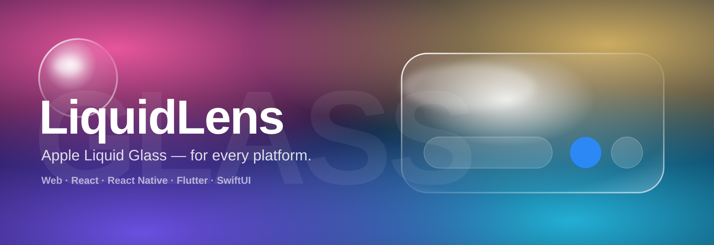

# 💧 LiquidLens: Apple Liquid Glass for Every Platform

**The iOS 26 Liquid Glass effect with real edge refraction. Blur was never the effect.**
One optical engine, five platforms: **Web · React · React Native · Flutter · SwiftUI.**

[](#-one-engine-five-platforms)
[](packages/core)
[](LICENSE)
[](CHANGELOG.md)

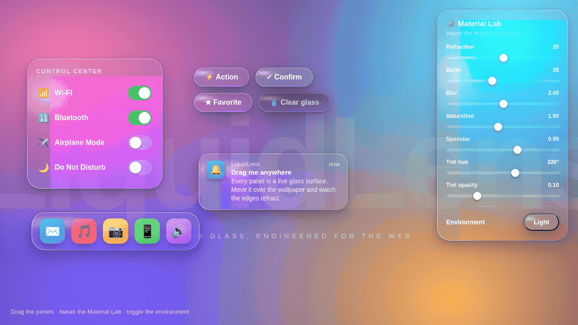

*↑ Real footage from [`artifacts/01-playground.html`](artifacts/01-playground.html). Drag any panel, tune the material live.*

**⭐ If LiquidLens saves you a week of shader math, star the repo. Stars are how other developers find it.**

</div>

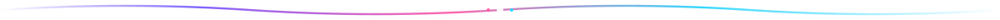

## 📖 Table of Contents

**[Blur is NOT Liquid Glass](#-blur-is-not-liquid-glass)** ·
**[Features](#-features)** ·
**[Quick start](#-quick-start-30-seconds-to-glass)** ·
**[Five platforms](#-one-engine-five-platforms)** ·
**[Showcase](#-showcase-gallery)** ·
**[How it works](#-how-the-refraction-works-the-60-second-physics)** ·
**[The vision](#-why-i-built-this)** ·
**[Docs](#-documentation)** ·
**[FAQ](#-faq)** ·
**[Contributing](#-contributing)**


## 🔍 Blur is NOT Liquid Glass

Search "liquid glass CSS" and nearly every tutorial hands you `backdrop-filter: blur(12px)` with a white tint. That recipe has a name: **glassmorphism**. It peaked in 2020. Apple's **Liquid Glass** (WWDC 2025, iOS 26, macOS Tahoe) is a different material entirely. It bends light at its edges, the way the rim of a real lens does. Hold a glass of water over a page of text and watch the letters warp near the rim. That warp is the effect. A blur can't produce it.

<div align="center">
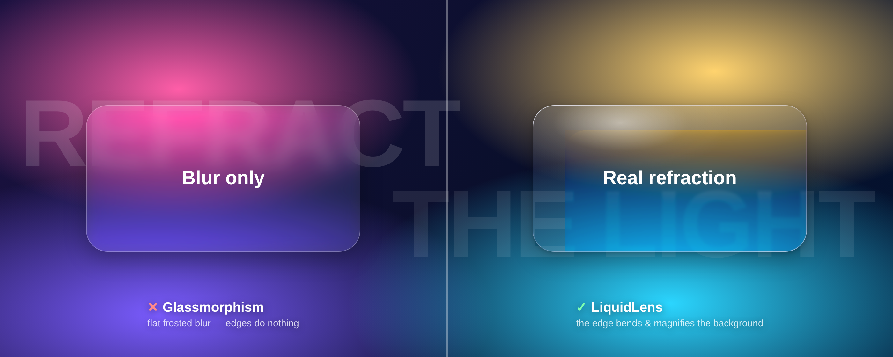
</div>

| | 🧊 Glassmorphism (what tutorials teach) | 💧 Liquid Glass (what Apple ships, what LiquidLens does) |
|---|:---:|:---:|
| Backdrop blur + tint | ✅ | ✅ |
| **Edge refraction / lensing** | ❌ | ✅ **the defining trait** |
| Motion-tracking specular highlight | ❌ | ✅ |
| Chromatic edge (light dispersion) | ❌ | ✅ |
| Adaptive shadow & legibility | ❌ | ✅ |
| Regular / Clear variants (Apple's vocabulary) | ❌ | ✅ |


## ⚡ Features

🔬 **Physically-based refraction.** A convex-squircle edge, Snell's law (air n=1.0 entering glass n=1.5), and signed-distance fields, compiled into a per-element displacement map. This is the optics implemented, not the optics imitated.

🪶 **Zero-dependency core.** One JS file, two CSS files. No build step, no framework, no npm account. A `<script>` tag gets you glass.

🎛️ **Live-tunable material.** Refraction, bezel, blur, saturation, specular, tint hue and opacity. All adjustable at runtime through `LiquidGlass.set()`.

✨ **Motion-reactive specular.** Highlights glide with the pointer, or with device tilt on mobile. The same cue you get from tilting an iPhone.

🧩 **Apple's real vocabulary.** `Regular` and `Clear` variants, semantic tints, press illumination, morph containers.

♿ **Accessible by default.** Honors `prefers-reduced-transparency` (opaque fallback, GPU work skipped), `prefers-reduced-motion`, and `prefers-contrast`.

📱 **Five platforms, one mental model.** The same parameters produce the same pixels on Web, React, React Native (Skia shader), Flutter (GLSL shader), and SwiftUI (Apple's native `glassEffect`).

🤖 **AI-ready.** Ships `AI_CONTEXT.md` plus five agent skills, so AI coding assistants build correct Liquid Glass from this repo on the first attempt.


## 🚀 Quick start (30 seconds to glass)

```html
<link rel="stylesheet" href="packages/core/tokens.css">
<link rel="stylesheet" href="packages/core/liquid-glass.css">

<div class="lg-glass" data-glass style="--lg-radius:28px; padding:24px;">
  Hello, glass.
</div>

<script src="packages/core/liquid-glass.js"></script>
<script>LiquidGlass.init({ refraction: 18, bezel: 22, blur: 3 });</script>
```

Done. A fully composited Liquid Glass pane with working edge refraction. More recipes:

```html
<!-- Clear variant over bright media (scrim keeps text legible) -->
<div class="lg-glass lg-clear" data-glass><span class="lg-scrim"></span> Play ▶ </div>

<!-- Semantic tint + press illumination -->
<button class="lg-glass lg-btn lg-tint-blue lg-press" data-glass>Confirm</button>

<!-- Tune the physics live -->
<script>LiquidGlass.set({ refraction: 34, tintHue: 280 });</script>
```

Prefer npm? `npm i @liquidlens/core`, then `import LiquidGlass from '@liquidlens/core'`.


## 🌍 One engine, five platforms

| Platform | Package | How refraction happens | Fallback |
|----------|---------|------------------------|----------|
| 🌐 **Web / vanilla JS** | [`packages/core`](packages/core) | SVG `feDisplacementMap` as `backdrop-filter` | blur + specular (Safari/Firefox) |
| ⚛️ **React** | [`packages/react`](packages/react) | `<LiquidGlass>` + `useLiquidGlass` over the core | same as web |
| 📱 **React Native** | [`packages/react-native`](packages/react-native) | `@shopify/react-native-skia` SkSL runtime shader | `expo-blur` glassmorphism |
| 🐦 **Flutter** | [`packages/flutter`](packages/flutter) | bundled GLSL fragment shader (`liquid_glass.frag`) | `BackdropFilter` blur |
| 🍎 **SwiftUI** | [`packages/swiftui`](packages/swiftui) | **Apple's native** `.glassEffect` (iOS 26+) | `.ultraThinMaterial` (pre-iOS 26) |

<details>
<summary><b>⚛️ React: show me the code</b></summary>

```tsx
import { LiquidGlass, useLiquidGlass } from '@liquidlens/react';
import '@liquidlens/core/liquid-glass.css';

function Card() {
  const { set } = useLiquidGlass({ refraction: 18, bezel: 22, blur: 3 });
  return <LiquidGlass radius={28} tint="blue" interactive>Hello</LiquidGlass>;
}
```
</details>

<details>
<summary><b>📱 React Native: show me the code</b></summary>

```tsx
import { LiquidGlassSkia } from '@liquidlens/react-native';

<LiquidGlassSkia width={300} height={160} radius={28} refraction={18} bezel={22}>
  <Text style={{ color: 'white' }}>Hello</Text>
</LiquidGlassSkia>
```
</details>

<details>
<summary><b>🐦 Flutter: show me the code</b></summary>

```dart
await LiquidGlassRefractive.load();          // once at startup
LiquidGlassRefractive(
  size: const Size(280, 160), borderRadius: 30, refraction: 18, bezel: 22,
  child: const Center(child: Text('Hello', style: TextStyle(color: Colors.white))),
);
```
</details>

<details>
<summary><b>🍎 SwiftUI: show me the code</b></summary>

```swift
Text("Hello").padding()
    .liquidGlass()                                    // native .glassEffect on iOS 26+
Button("Save") {}.liquidGlassStyle(prominent: true, tint: .blue)
```
</details>


## 🖼️ Showcase gallery

Six production-quality screens. Each one is a **single self-contained HTML file**. Open in Chrome, Edge, or Arc. No build step.

| | | |
|:---:|:---:|:---:|
| 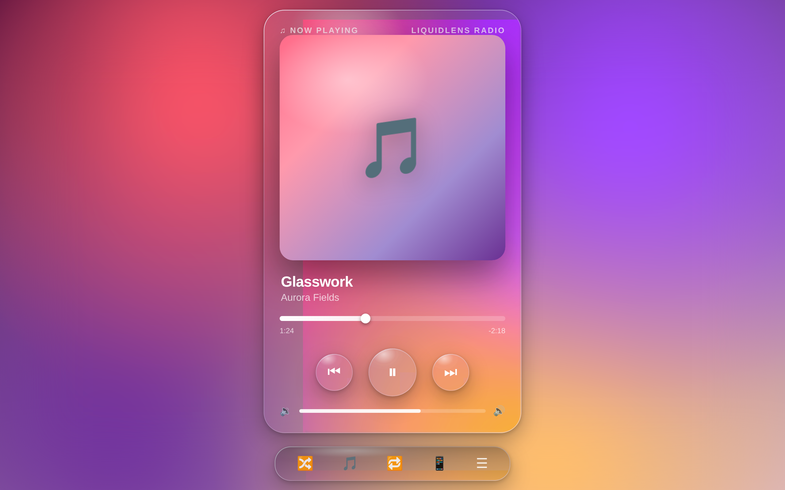<br>[🎵 Music player](artifacts/02-music-player.html) | 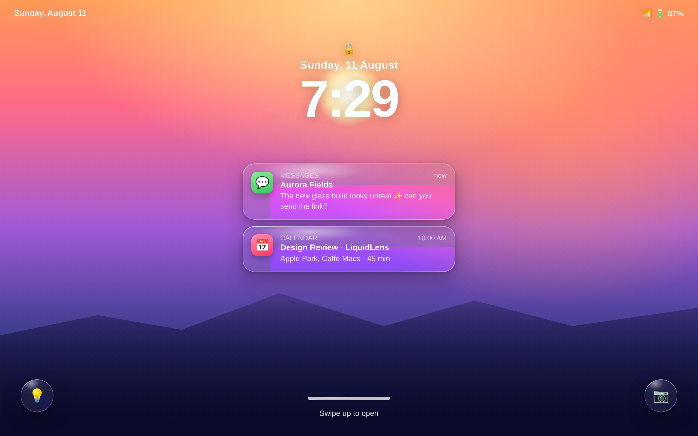<br>[🔒 Lock screen](artifacts/03-lockscreen.html) | 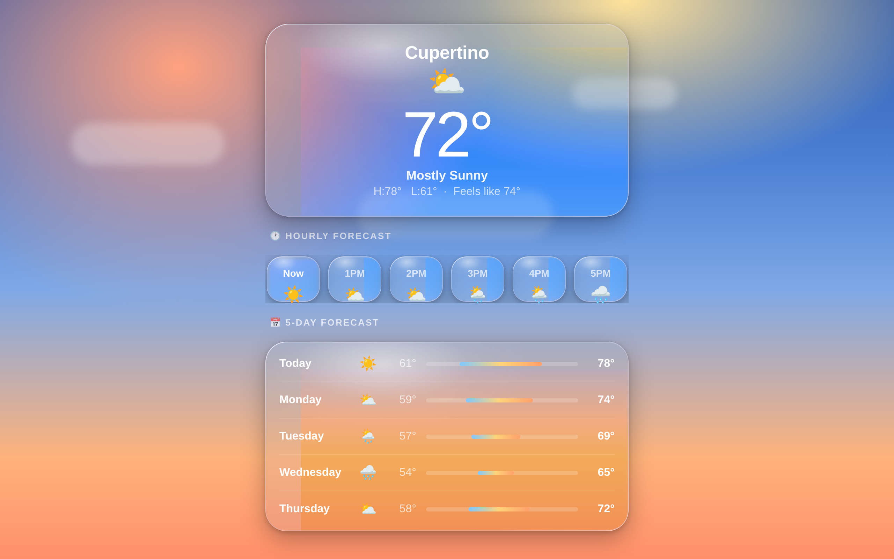<br>[⛅ Weather](artifacts/05-weather.html) |
| 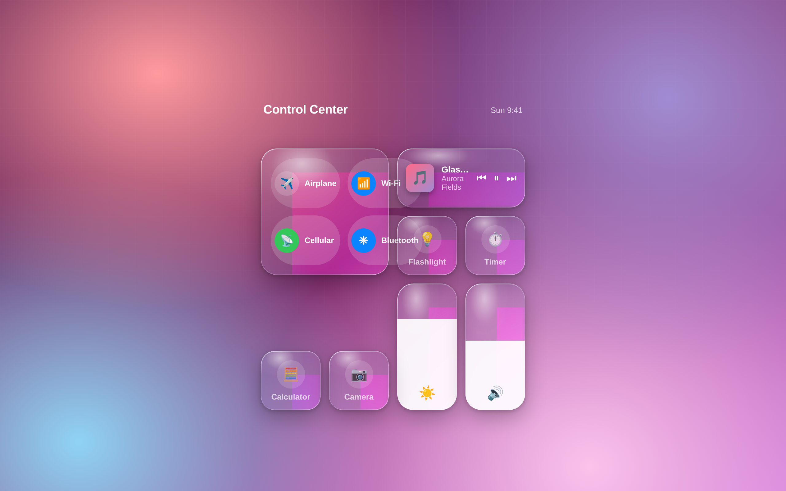<br>[🎛️ Control Center](artifacts/04-control-center.html) | 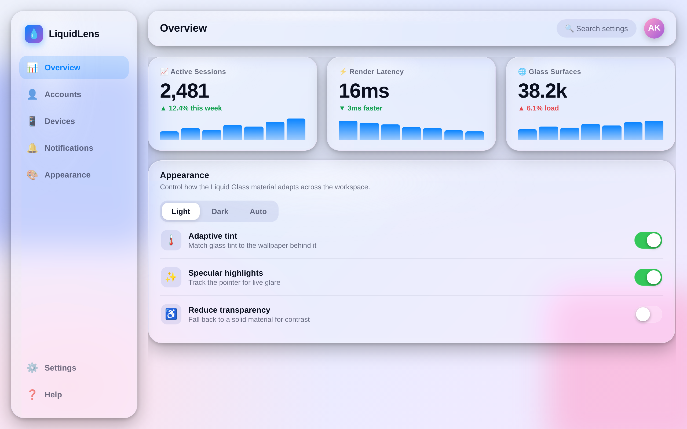<br>[📊 Dashboard](artifacts/06-dashboard.html) | 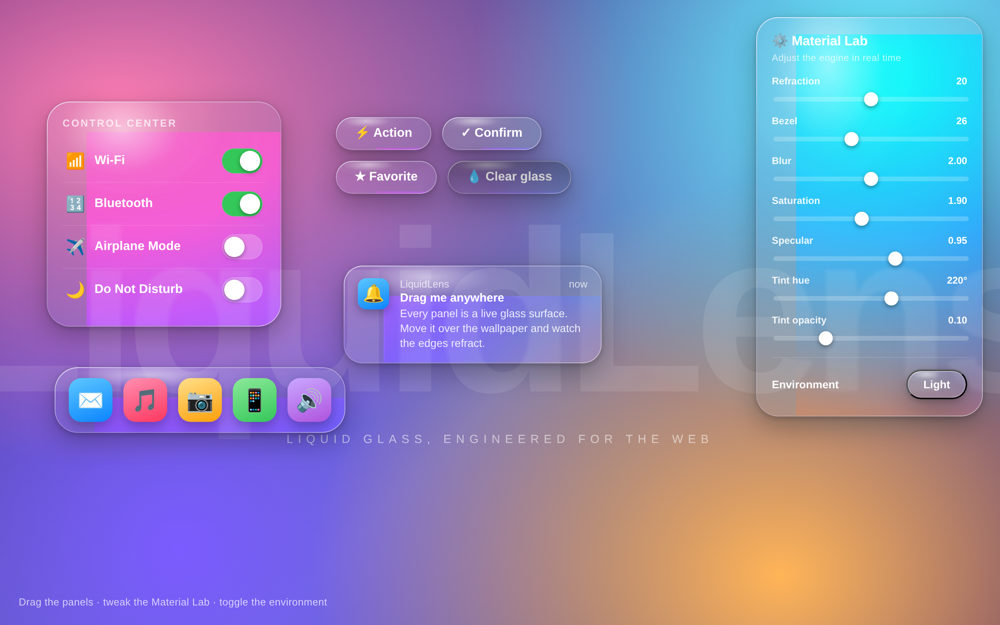<br>[🧪 Playground](artifacts/01-playground.html) |

The [`examples/`](examples) folder adds **14 focused component demos**: buttons, toolbars, docks, segmented controls, sliders, notifications, search bars, modals, chips, side panels, tooltips.


## 🧠 How the refraction works (the 60-second physics)

<div align="center">
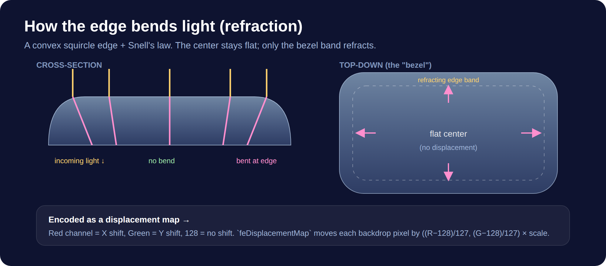
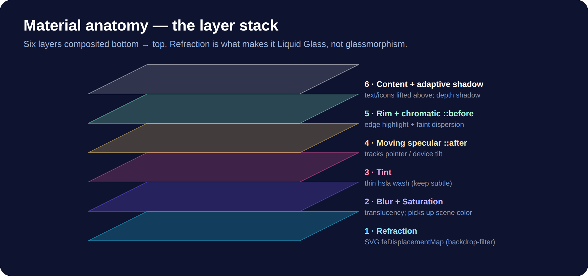
</div>

1. Model the glass **edge** as a **convex squircle**: `height(x) = (1 − (1−x)⁴)^¼`. Apple builds its shapes on this superellipse.
2. Across the edge band, apply **Snell's law** (`n₁ sin θ₁ = n₂ sin θ₂`, air into glass at 1.5) to get each ray's deflection.
3. Read every pixel's depth and outward direction from a rounded-rect **signed distance field**.
4. Encode the deflections into a bitmap. **Red = X shift, Green = Y shift, 128 = neutral.**
5. `feDisplacementMap` shifts the backdrop by `((R−128)/127) × scale`. The background magnifies at the rim, the way it does through real glass.

The same model ships as an **SkSL shader** for React Native and a **GLSL fragment shader** for Flutter, so `refraction: 18` means the same 18 pixels on every platform. Full math with code: [`docs/02-optics-and-physics.md`](docs/02-optics-and-physics.md).


## 🎯 Why I built this

> Built by **[Ashutosh Sharma](https://devbehindyou.vercel.app)**, aka **[DevBehindYou](https://github.com/DevBehindYou)**. *Developer at heart, SEO specialist by mind, analyst by habit.* "I Engineer Visibility."

When Apple unveiled Liquid Glass at WWDC 2025, I went hunting for a faithful web implementation. I found an ocean of `blur(12px)` tutorials wearing the name. The lensing, the one behavior that makes the material read as alive, was missing from every single one. Nothing spanned the platforms a real product ships on either.

So I did it the hard way. I read the physics, reverse-engineered the displacement-map technique, and verified the output pixel by pixel in a real rendering engine: 20 pages, zero console errors, refraction confirmed on every glass element before I called it done. Then I wrapped the whole thing in Apple's own design vocabulary (Regular and Clear, tints, interactive, morph) and ported one optical model to Skia, GLSL, and Apple's native API.

The goal: any developer, or any AI agent, should ship correct and accessible Liquid Glass in minutes, on any platform, with no PhD in optics required. This repo is the library plus the complete knowledge base behind it.


## 📚 Documentation

Start with the friendly **[ELI5 explainer](docs/00-eli5.md)** 🧒. Then go as deep as you want:

| Learn | Build | Master |
|---|---|---|
| [What is Liquid Glass?](docs/01-what-is-liquid-glass.md) | [Web implementation guide](docs/06-web-implementation.md) | [Full API reference](docs/10-api-reference.md) |
| [Optics & physics](docs/02-optics-and-physics.md) | [Design tokens & theming](docs/08-design-tokens.md) | [Cross-platform guide](docs/11-cross-platform.md) |
| [Material anatomy](docs/03-material-anatomy.md) | [Regular vs Clear variants](docs/04-variants-regular-clear.md) | [Browser support & perf](docs/07-browser-support.md) |
| [UI/UX guidelines (HIG)](docs/05-ui-ux-guidelines.md) | [Accessibility](docs/09-accessibility.md) | [FAQ](docs/12-faq.md) |

🤖 **For AI agents:** [`AI_CONTEXT.md`](AI_CONTEXT.md) is a dense machine-readable spec, and [`skills/`](skills) carries five ready-to-use skills (web, React, Flutter, SwiftUI builders, plus a QA **auditor**).


## ❓ FAQ

<details><summary><b>Why does my glass render as plain blur in Safari or Firefox?</b></summary>
Using an SVG filter as a <code>backdrop-filter</code> (the refraction path) currently works in <b>Chromium</b> engines: Chrome, Edge, Arc, Brave, Opera. Safari and Firefox fall back automatically to blur + specular, which still reads as quality glass. Apple's native platforms refract everywhere. That gap is the reason the SwiftUI port calls the system <code>glassEffect</code> instead of imitating it. <a href="docs/07-browser-support.md">Details →</a></details>

<details><summary><b>How is this different from a glassmorphism CSS generator?</b></summary>
Generators output a blur, a tint, and a border. LiquidLens adds the missing physics: a per-element displacement map bends the backdrop at the edges, the optical signature of Apple's material. See the <a href="#-blur-is-not-liquid-glass">comparison above</a>.</details>

<details><summary><b>My glass is invisible. Why?</b></summary>
Two usual causes. The element sits over a flat background (glass needs a rich backdrop to refract: gradients, photos, text). Or <code>blur</code> is set so high it erases the lensing. Keep blur between 0 and 4 px.</details>

<details><summary><b>Does it hurt performance?</b></summary>
Displacement maps are generated on create and resize only, capped by the <code>quality</code> parameter. Animate <code>transform</code> and <code>scale</code>, which stay cheap. Prefer a few large panes over dozens of tiny ones. <a href="docs/07-browser-support.md">Performance model →</a></details>

<details><summary><b>Is it accessible?</b></summary>
Yes. <code>prefers-reduced-transparency</code> swaps in an opaque surface and skips the GPU work. <code>prefers-reduced-motion</code> freezes highlights. <code>prefers-contrast</code> strengthens edges. <a href="docs/09-accessibility.md">Accessibility guide →</a></details>

<details><summary><b>Can I use it in production?</b></summary>
The core is dependency-free, MIT-licensed, and degrades cleanly. Treat the refraction as progressive enhancement (Chromium gets the full effect), keep text contrast WCAG-compliant, and you are production-ready. The RN Skia and Flutter shader paths are marked experimental. Test those on your target devices first.</details>

<details><summary><b>Does it work with Tailwind / Next.js / Vue / Svelte?</b></summary>
Yes. The core is framework-agnostic. Any element carrying <code>class="lg-glass" data-glass</code> works. The React package adds idiomatic bindings. Other frameworks can call <code>LiquidGlass.apply(el)</code> directly.</details>


## 🤝 Contributing

PRs welcome. The bar lives in [CONTRIBUTING.md](CONTRIBUTING.md). Short version: refraction is non-negotiable, accessibility ships with the feature, and the core stays dependency-free. Found a bug? Open an issue with a screenshot over a busy background.

**⭐ Star the repo** if this saved you time. Stars are how other developers find real Liquid Glass.

## 📄 License

[MIT](LICENSE) © [Ashutosh Sharma (DevBehindYou)](https://devbehindyou.vercel.app). *"Liquid Glass" is Apple's design language. LiquidLens is an independent, educational implementation, not affiliated with or endorsed by Apple Inc.*

---

<div align="center">
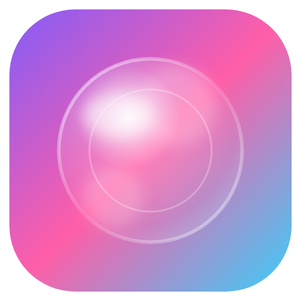<br>
<sub><b>LiquidLens</b> · Apple Liquid Glass UI library · iOS 26 glass effect · CSS refraction · glassmorphism, evolved<br>
Web · React · React Native · Flutter · SwiftUI. Made with Snell's law and love for the craft.<br><br>
Built by <a href="https://devbehindyou.vercel.app"><b>DevBehindYou</b></a> (Ashutosh Sharma) ·
<a href="https://github.com/DevBehindYou">GitHub</a> ·
<a href="https://www.linkedin.com/in/devbehindyou/">LinkedIn</a> ·
<a href="https://medium.com/@devbehindyou">Medium</a> ·
<a href="https://x.com/devbehindyou">X</a></sub>
</div>
